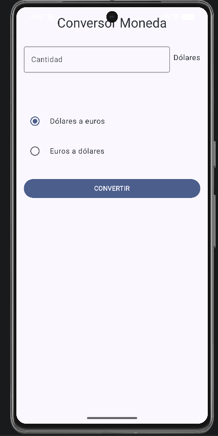

# 💱 Conversor de Moneda - Android Jetpack Compose

  

## 📋 Enunciado y Solución

El objetivo de la aplicación es obtener una tasa de cambio (Dólares <-> Euros) desde un fichero remoto (`cambio.txt`) alojado en un servidor, actualizarla periódicamente y permitir al usuario realizar conversiones incluso sin conexión.

### Características Implementadas:

1.  **Servicio en Segundo Plano (WorkManager):**
    *   Se utiliza `PeriodicWorkRequest` para descargar el fichero `cambio.txt` cada **15 minutos** (intervalo mínimo del sistema).
    *   La tarea se ejecuta incluso si la aplicación está cerrada.
    *   Gestión de restricciones: Requiere conexión a Internet (`NetworkType.CONNECTED`).

2.  **Persistencia de Datos (SharedPreferences):**
    *   **Fallback:** Si la descarga falla (servidor caído, sin internet), la app utiliza el **último valor descargado** exitosamente.
    *   **Valor por defecto:** Si es la primera vez que se abre la app y no hay internet, se utiliza un valor predefinido (`0.92`).

3.  **Interfaz de Usuario (Jetpack Compose):**
    *   Diseño declarativo moderno siguiendo **Material Design 3**.
    *   Arquitectura **MVVM** (Model-View-ViewModel) para separar la lógica de negocio de la UI.
    *   Estado reactivo: La UI se actualiza automáticamente cuando cambia el resultado de la conversión.

4.  **Notificaciones:**
    *   Cada vez que `WorkManager` actualiza la tasa con éxito, se muestra una notificación del sistema al usuario.

---
